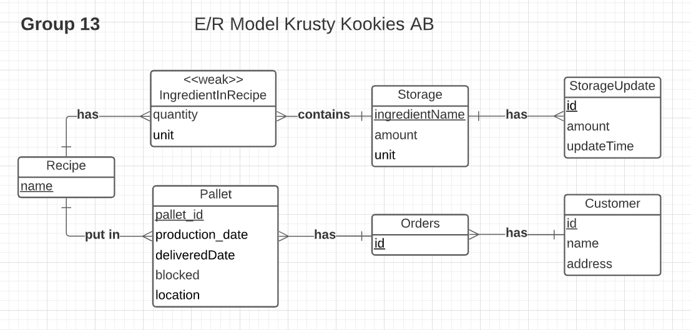

# Krusty Kookies - REST API for cookie creation.

This project was a part of the course Database Technology, *EDAF20* at Lunds University, 2021.
The aim was to develop a REST API for a cookie company using Java and MySql.
The project was finished on 2021-04-23.

## E/R Model

## Project description
- **Database modeling:** Your group should create a model for a database for the supervision of production and delivery of cookies produced by the company “Krusty Kookies Sweden AB” (see below).

- **Design review meeting:** Your model will be discussed during the peer review session (see above and below). You should print out and bring your E/R model (UML) to the meeting, and there, you and one or two other groups will discuss your designs with each other, and with your TA.

- **Implementation of the database:** Once your model is reviewed by other groups, and approved by your TA, you can define relations and implement the database.

- **Development of a REST API:** The description of the REST API can be read [here](Documents/REST_API.pdf). There is already a GUI which lets you try out parts of your service, and there is automated test cases which tests it more comprehensively.

- **A written report:** A precise description of what the report should contain can be found below.

---

## Problem
Read details Krusty Kookies [here](Documents/Problem.pdf)

---

## Program requirements
Your submission must contain:

1. A diagram which shows your model (using UML) – we prefer machine produced diagrams, a scanned in handwritten diagram is OK only if it’s very, very tidy (drawing by hand makes it much harder to change your model, so we recommend that you use some program to draw your model). One tool that does the job is UMLet (Links to an external site.).
\
We’re going to be very fuzzy about this diagram, it must be absolutely correct (proper UML-notation, primary keys marked, no foreign keys, weak entity sets marked, all multiplicities written out, etc.).

2. A file `create-schema.sql` with the SQL statements needed to create the tables of your database.

3. A file `initial-data.sql` with the SQL statements needed to insert test data to the database so we can test the program properly.

3. A PDF file `report.pdf`, which contains your report. The report should show:

   1. The UML diagram of your ER-model .
   2. Your relations, with primary keys and foreign keys marked correctly, and proper naming.
   3. Short description of how to setup your server (i.e., how to compile/run the program). Describe if you have changed any other file than Database.java or if you have added new files to the project.

5. The source code for your REST service.

### Submission:

- Each group will upload the completed project via two zip files here  in the following fashion:

  - Submit files (listed in 1-4 under Submission Requirements section) in one zip file named CourseProjectXX, where XX is the number of your course project group

  - Submit the source code of the REST service  ( (listed in 5 under Submission Requirements section) by uploading a zip file of the Eclipse . This zip file should be named RestXX, where XX is again the number of your course project group

- Any submitted code that **does not** use the static variable `Database.jdbcString` as the actual JDBC connection string is an automatic reject, and will have to be corrected and resubmitted. You may freely change its content to fit either a local MySQL installation, puccini.cs.lth.se or SQLite, but you must specify and use this variable for this purpose.

---

## Imporant dates
- **Tuesday 2/3:** Peer review of the database design during exercise session 6.
	- Bring your E/R model to the meeting!
	- Note that the first session session (13.15-15.00) is for IDA and the second session (15.15-17.00) is for IEA.
- **Monday 10/05 at 12:00:** Deadline for the final report and program.
